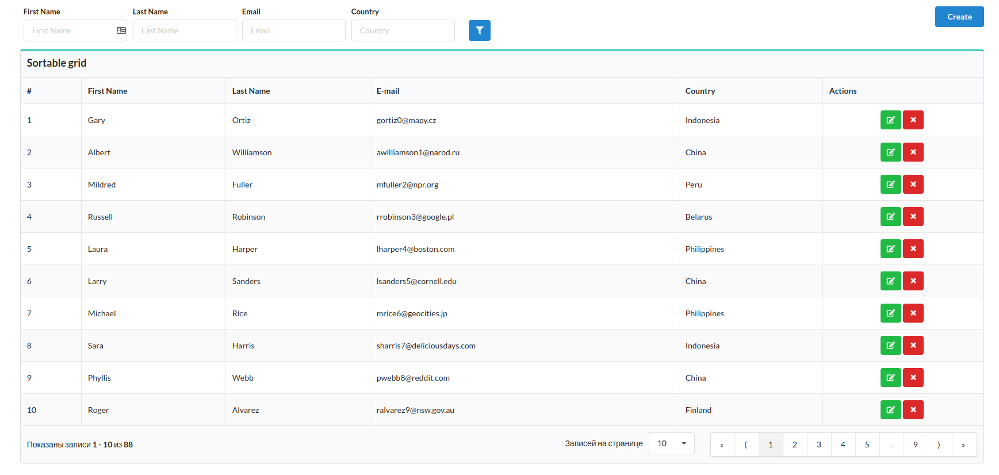
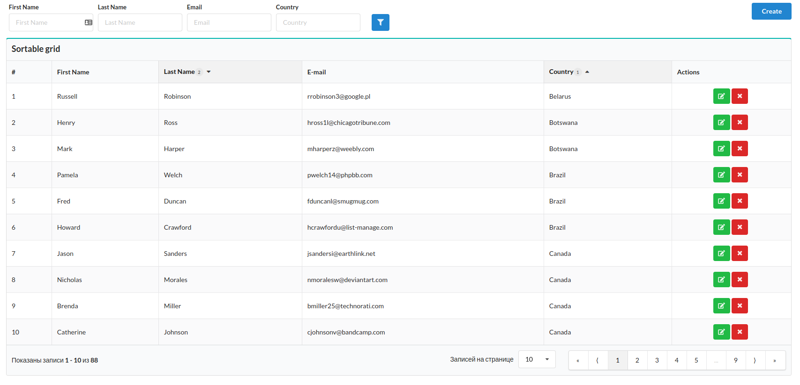
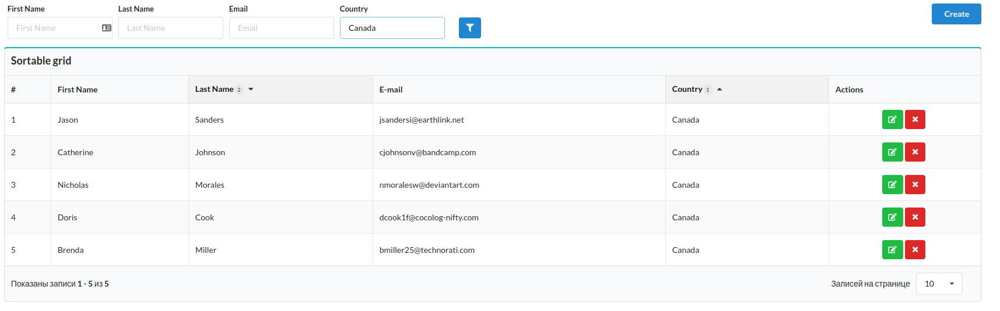

Installation
-----------

**npm i --save semantic-data-grid**

Example: **cd example/ && npm i && npm start. Enjoy!**

[Live demo](https://qimus.github.io/semantic-ui-grid/)

Hot it use
----------

```javascript
import {
    Column,
    Provider as DataProvider,
    Action,
    ExtTable,
    setHistory
} from 'semantic-grid'

const history = createBrowserHistory({ basename: '' });
setHistory(history);

const provider = new DataProvider.ArrayDataProvider({ data: store.getItems() });

const columns = [
    {
        title: '#',
        type: Column.SERIAL_COLUMN,
        sortable: true
    },
    {
        title: 'First Name',
        field: 'first_name',
        sortable: true
    },
    {
        title: 'Last Name',
        field: 'last_name',
        sortable: true
    },
    {
        title: 'E-mail',
        field: 'email',
        sortable: true,
    },
    {
        title: 'Country',
        field: 'country',
        sortable: true
    },
    {
        title: 'Actions',
        type: Column.ACTION_COLUMN,
        actions: [
            {
                component: Action.EditAction,
                link: (row) => `/users/${row.id}`
            },
            {
                component: Action.DeleteAction,
                action: ({ id }) => {
                    store.deleteItem(id);
                }
            }
        ]
    }
];
const filter = {
    name: 'users_filter',
    items: [
        {
            name: 'first_name',
            type: 'text',
            label: 'First Name'
        },
        {
            name: 'last_name',
            type: 'text',
            label: 'Last Name'
        },
        {
            name: 'email',
            type: 'text',
            label: 'Email'
        },
        {
            name: 'country',
            type: 'text',
            label: 'Country'
        }
    ]
};

class DemoGrid extends Component {
    render() {
        return (
            <Grid>
                <Grid.Row>
                    <Grid.Column width={1}></Grid.Column>
                    <Grid.Column width={14}>
                        <Header as={'h2'}>Semantic ui grid example</Header>
                        <Button floated='right' primary onClick={() => this.props.history.push('/users/new')}>Create</Button>
                        <ExtTable
                            filter={filter}
                            sortable={true}
                            header={'Sortable grid'}
                            provider={provider}
                            columns={columns}/>
                    </Grid.Column>
                </Grid.Row>
            </Grid>
        )
    }
}
```

ExtTable props
-------

|Prop|Type|Description|
|----|----|-----------|
|filter|Object| which include filter name and array of filter items |
|provider|Function| Instance one of ApiDataProvider or ArrayDataProvider|
|onPageChange| Function| Handler which will be call after each one page change|
|columns|Array| Array of table columns|
|header|String| Header of grid|
|sortable|Bool|Columns of table can sortable|
|isFetching|Bool| Indicate to show loader|
|filterNamePrefix|String|Prefix for filter params in search of browser|

Column props
-----

|Prop|Type|Description|
|----|----|-----------|
|columnOptions|Object|Any props from Table.Cell Semantic ui|
|component|React.Component|Custom component for render cell|
|type|string|One of type which was registered with *registerColumnTypes* function|
|value|any||
|field|string|Name of the field that value will be show|

Filter props
-----------

|Prop|Type|Description|
|----|----|-----------|
|type|string|One of type which was registered with *registerFilterTypes* function|
|component|React.Component|Custom component|
|updateAfterChange|bool|After each change fetch data|
|options|object|Props for Grid.Column|

Custom types
------------
You can define custom types of columns and filters.
For example:

```javascript
import { registerColumnTypes } from 'semantic-grid'

import MyCustomSuperColumn from './super-column'

const SUPER_COLUMN = 'super_column';

registerColumnTypes({
    [SUPER_COLUMN]: MyCustomSuperColumn
});

let columns = [
    {
        type: SUPER_COLUMN,
        //.....
    }
];

class MyComponent extends React.Component {
    render() {
        return (
            <ExtTable columns={columns}
                //some other props
            />
        )
    }
}

```

Screenshots
----------





